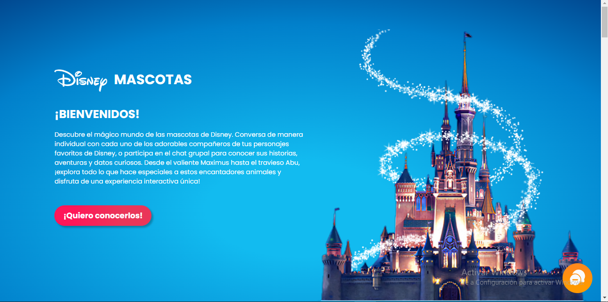
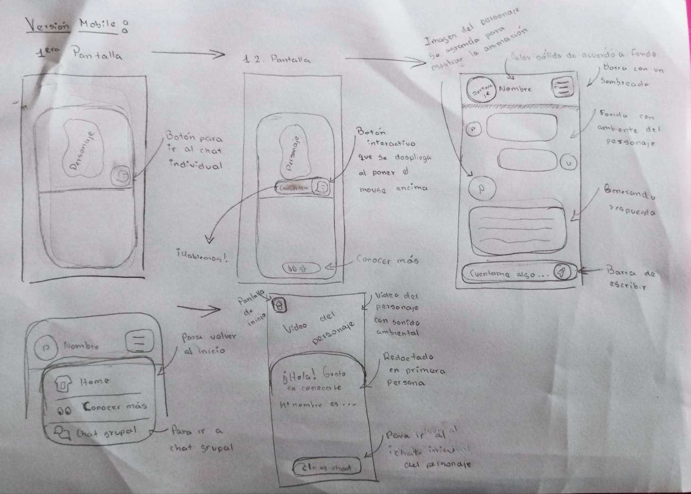
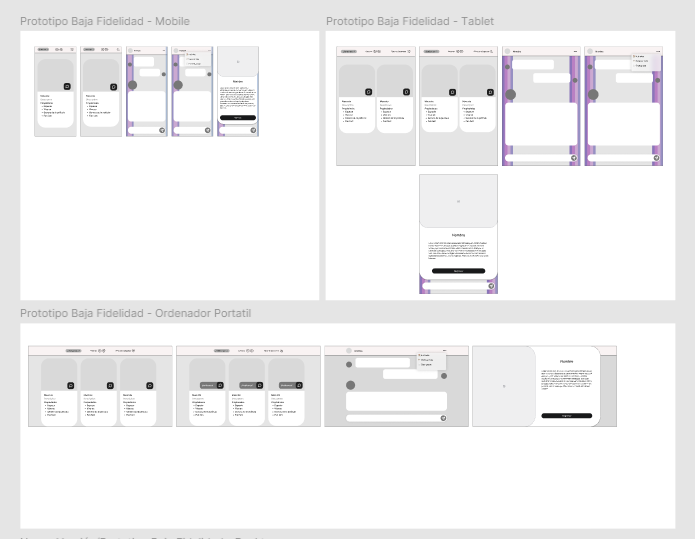
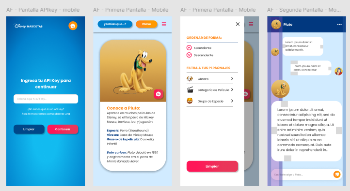

# Disney Mascotas - SPA

## Índice

* [1. Resumen](#1-resumen)
* [2. Definición de la Aplicación](#2-definición-de-la-aplicación)
* [3. Historias de Usuario](#3-historias-de-usuario)
* [4. Diseño de la Interfaz de Usuario](#4-diseño-de-la-interfaz-de-usuario)
* [5. Test de Usabilidad](#5-test-de-usabilidad)

***

## 1. Resumen

Disney Mascotas es una SPA (Single Page Application) diseñada para los fans de Disney que desean explorar a fondo las mascotas que acompañan a sus personajes favoritos. La aplicación combina diversión, interactividad y educación al permitir conversaciones con los personajes a través de una inteligencia artificial avanzada. Su interfaz intuitiva facilita la navegación y permite a los usuarios filtrar y ordenar los personajes por género, grupo de especie y tipo de película, ofreciendo una experiencia de búsqueda precisa y personalizada.

Además, Disney Mascotas presenta una sección de estadísticas que proporciona una visión general de la distribución de las mascotas según diversos criterios, como género y especie. Para enriquecer aún más la experiencia del usuario, la aplicación incorpora un chat interactivo impulsado por inteligencia artificial, que permite a los usuarios conversar directamente con las mascotas de Disney. A través de esta función, los usuarios pueden disfrutar de interacciones personalizadas y educativas, haciendo preguntas y recibiendo respuestas que imitan las personalidades de los personajes. Esta innovadora integración de tecnología avanzada no solo aporta un toque de magia a la aplicación, sino que también convierte cada sesión en una experiencia única y envolvente dentro del encantador mundo de Disney.

## 2. Definición de la Aplicación

**Disney Mascotas** es una aplicación web innovadora creada para los amantes de Disney que desean sumergirse en el fascinante mundo de las mascotas de sus personajes favoritos. 
Esta plataforma no solo ofrece información detallada sobre cada mascota, sino que también permite a los usuarios interactuar con ellas de una manera única y personalizada. A continuación, se presentan las funcionalidades clave que definen y enriquecen la experiencia del usuario:

### Características Clave

1.	Interacción Personalizada: A través de un chat impulsado por inteligencia artificial, los usuarios pueden tener conversaciones directas con las mascotas de Disney, obteniendo respuestas que reflejan la personalidad y las características de cada personaje.
2.	Visualización y Filtrado Avanzado: La aplicación ofrece opciones de filtrado y ordenamiento intuitivas, permitiendo a los usuarios explorar las mascotas según criterios como género, especie y tipo de película, facilitando una búsqueda más precisa y personalizada.
3.	Estadísticas Dinámicas: Disney Mascotas incluye una sección dedicada a mostrar estadísticas sobre la distribución de las mascotas, proporcionando una visión analítica del universo de personajes según género, especie y género de película.
4.	Single Page Application (SPA): Diseñada como una SPA, la aplicación permite una navegación fluida y rápida sin recargas de página, mejorando la usabilidad y garantizando una experiencia de usuario continua.
5.	Visualización Dinámica: La estructura de la aplicación permite que los usuarios cambien entre diferentes secciones (chat, filtros, estadísticas) de manera dinámica y sin interrupciones.
6.	Diseño Responsivo y Atractivo: Con una interfaz atractiva y responsiva, la aplicación se adapta a distintos dispositivos, proporcionando una experiencia visual coherente y alineada con la estética mágica del universo Disney.

## 3. Historias de Usuario

- **Historia de Usuario 1:**
Como usuario quiero que los filtros de la aplicación funcionen en conjunto para obtener una búsqueda más precisa de las mascotas en la aplicación.
- **Historia de Usuario 2:**
Como usuario quiero tener una experiencia visual agradable y con un tono infantil mediante iconos y emojis para tener una sensación más divertida dentro de la aplicación. 
- **Historia de Usuario 3:**
Como usuario quiero que la página sea mayormente interactiva para disfrutar de una experiencia mágica, como el mundo Disney.
- **Historia de Usuario 4:**
Como usuario quiero que los chats ocupen toda la pantalla para poder visualizar correctamente la información y tener mayor comodidad al escribir. 
- **Historia de Usuario 5:**
Como usuario quiero una experiencia de navegación rápida para evitar abrumarme/aburrirme dentro de la aplicación. 

## 4. Diseño de la Interfaz de Usuario
### Prototipo de baja fidelidad 
Estos primeros prototipos fueron elaborados a papel y lápiz:

### Wireframes 
Pasamos a digital los prototipos realizados en papel y realizamos los cambios necesarios después de testear con un grupo de potenciales usuarios de la página:

### Prototipo de alta fidelidad 
Después de los cambios realizados anteriormente, se procedió a armar los prototipos a color y la versión ideal de la página, la cual, igualmente se testeo con un grupo potencial de usuarios y se realizaron los cambios pertinentes para finalmente obtener la versión final del prototipo:

 
## 5. Test de Usabilidad
A continuación, se muestra el listado de problemas detectados en los test de usabilidad y las soluciones implementadas dentro de la aplicación: 
| Problema detectado   | Solución implementada   |
| ----------- | ----------- |
| El usuario ignoraba el botón “¡Quiero conocerlos!” | Se le agregó una animación al botón que se activa cuando el usuario pasa el cursor encima, incentivándolo a querer presionarlo. |
| El usuario no comprendía si el botón dentro de cada tarjeta era para dejar un comentario o ir a un chat. | Se le agregó una etiqueta desplegable animada a los botones para indicar que al darle click se puede hablar con el personaje. |